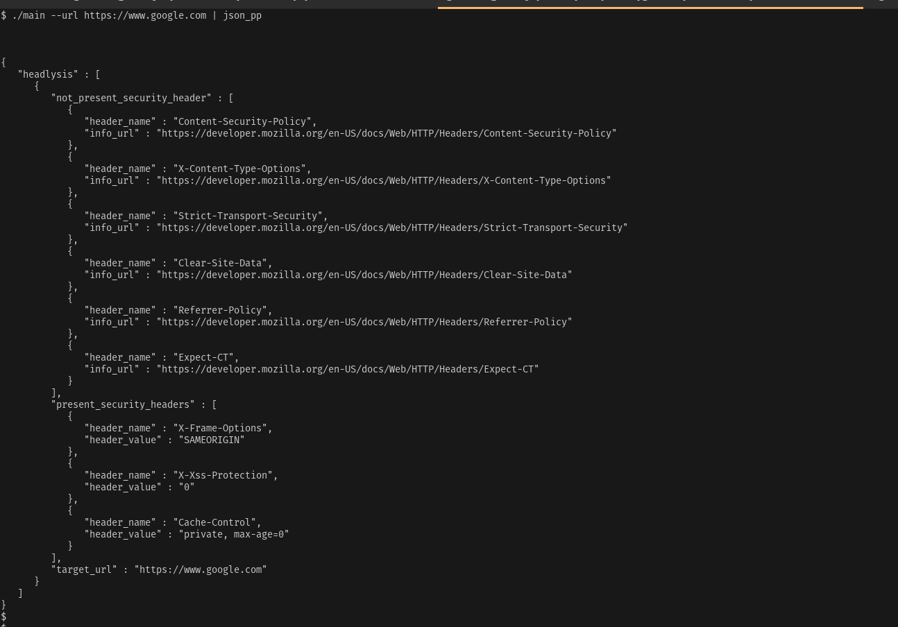

## Headlysis

A tool for checking security headers present in a website.


## Building

```bash
	cd main
	go build main.go -o main
```

## Usage

> 2 Modes of operation.


1. Checking single url.
```bash
	cd main
	./main --url https://google.com
```


2. Checking a file containing websites.
```bash
	cd main
	./main --url-file top100.txt --output-file top100.out --threads 25
```



